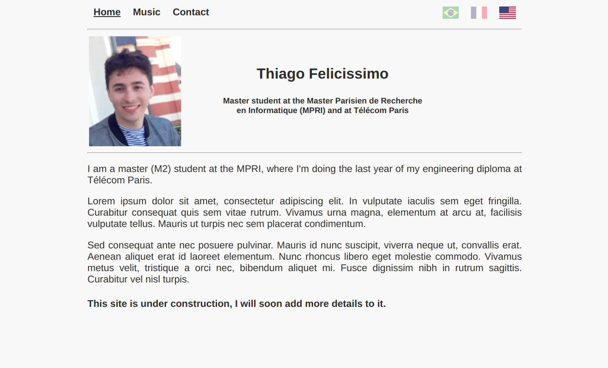

# Simple Personal Website Generator

This is a small website generator I wrote to make it easier for me to manage my personal website. It is not very customizable, as it was made using my own personal template in mind, but it serves well the purpose of beeing a simple solution to automatize some of the boring and mechanical tasks linked to adding and edditing the pages, specially when doing so for a multi-language website.

Some of the features that make it a very useful tool for me are

- Given a list of languages, generates .com for the main language and .com/language for each of the other languages
- Each page has its content in all languages defined in a single file
- Generates automatically nagivation bar that allows to change between pages of a language version or to the same page in other languages
- Allows for the declaration of macro for file paths, which are appropriatly replaced by the correct path for each language version, allowing for homogeneous handling of file references among all language versions
- For each page of the site, allows user to chose in which languages it will be available
- Does not require any framework and generates a static pure html and css website, suitable for simple lightweight applications

The last point is particularly positive for me, as I have very little experience in web developpement and I just needed a simple way of managing a small webpage. 

## How to use

The configuration files are set up for my personal website, you can take a look at them to see an example of how everythings works.

In order to configure the website, change the following files located at the directory `config`

- `config.txt` : Sets the languages and the website name. Languages currently available are English (`en`), French (`fr`) and Brazilian Portuguese (`br`), but can be extended by adding the corresponding flags at the directory `flags`.
- `pages.txt` : Each line declares a page. At column `0` we have the page name, from columns `1` to `num_languages` we have `1` if page is present in this language and `0` otherwise, and from columns `num_languages + 1` to `2 * num_languages` we have the page display name in each language (which is shown in the navigation bar).
- `paths.txt` : Each line declares a file path macro. At column `0` we have the macro and at column `1` we have the file path, relative to directory `paths`.
- `subtites.txt` : Declares in each language a small subtitle to be shown under the page's title on the homepage.

For each page foo declared at `pages.txt` a file `foo.html` must be present at the directory `pages`, and moreover a file `home.html` should be present.

The file `foo.html` will contain the contents of the page foo in each language, and the versions should be separed by the expression `!split!`. The same holds for `home.html`, that declares the contents to be shown at the homapage, under the title. For any page, there should be `num_languages - 1` splits in its file, even if the file is not available in all languages.

Any file path macro declared at `paths.txt` can be used in any language version of a page, in an homogeneous way. I like my macros to follow the pattern `!MACRO!`.

The files `model.html` and `index_model.html` at directory `config` defines the templates used, and the file `style.css` at directory `paths` is the one used for the site.

The images at directory `flags` are used as the icons to switch between languages. Each languages has an active version and an inactive one, in which a white layer is added.

Once all the files are set it suffices to make `python make.py` and the website will be generated at the directory `out`.

